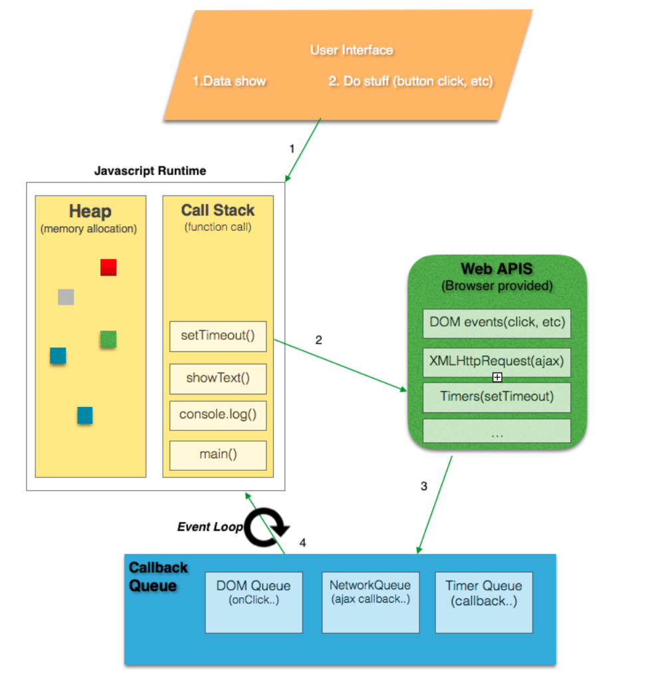
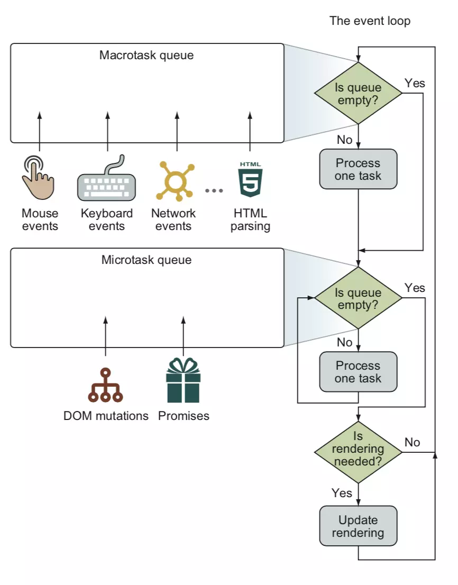

事件迴圈（Event Loop）是一個我以為我懂了，但直到最近才發現自己什麼都不懂的概念。

會發現這件事，是因為我在研究 React Fiber 的過程中，獲知了一個能提升網頁性能的 API `requestIdleCallback`，它的回呼（callback）會在瀏覽器空閒（idle）時執行，其中一個時機點是幀尾。

問題來了，什麼是「幀尾」？要回答這個問題，首先當然要知道什麼是「幀」（frame）？原本我以為，幀就**等同於**網頁畫面更新——每一幀，畫面就更新一次。但若是這樣，哪來的「尾」可以給 `requestIdleCallback` 執行？或許，一幀除了更新，還做了許多事？

就這樣，我從想瞭解一幀究竟做了哪些事，不小心掉進事件迴圈的漩渦，糾纏了一個多禮拜才爬出來，又花了好幾天才煉成這篇文章。

本文將從官方規範下手，看完它，你便能回答：

- 事件迴圈的運作流程為何？
- 「幀」是什麼？
- `setTimeout`、`requestAnimationFrame`、`requestIdleCallback` 分別發生在事件迴圈的哪個階段？
- 宏任務（macrotask）和微任務（microtask）是什麼？它們與事件迴圈的關係是什麼？
- 每輪事件迴圈都會更新畫面嗎？
- JavaScript 是單執行緒（single threaded），但卻能發出 HTTP 請求而不阻塞（non-blocking），這是怎麼辦到的？

## JS 單執行緒卻不阻塞的祕密

在開始之前，先來看一張圖：



不用看太久，有個概念就好；等你讀完這篇文章，就能看懂這張圖了。

首先要闡明，事件迴圈是與 JS 的運行（runtime）環境相關的機制，它與 JS（引擎）本身無關。常見的運行環境有瀏覽器、Node.js，每種運行環境可能都有自己實現事件迴圈的方式，而本文只探討瀏覽器的事件迴圈（Node.js 的事件迴圈也是一個重要的主題，等哪天我搞懂了再來寫）。

為什麼需要事件迴圈？這與 JS 單執行緒的特性有關。單執行緒意味著 JS 一次只能執行一段程式碼，當 JS 在調用（invoke）一個函式時，沒有任何其它程式碼可以**同時**運行，除非這個函式結束或被中斷（suspended）（後者可用 [generator](https://javascript.info/generators) 達成）。

深入點說，JS 內部有一個呼叫堆疊（call stack），又稱為執行上下文堆疊（execution context stack），這個堆疊是用來追蹤程式所呼叫的函式。每當程式調用一個函式，這個函式所產生的執行上下文便會被壓入（push）堆疊；當這個函式執行完，便會被彈出（pop）。函式的執行順序遵循「後進先出」（LIFO, Last In First Out）的模式。

單執行緒雖簡單易懂，但卻有一個明顯的問題：假如一個函式執行過久，便會卡住之後函式的執行。如果這些函式恰好是做與 UI rendering 相關的事，那畫面便會延遲更新，這對使用者體驗來說是致命的。

現在讓我們來想一下，JS 有什麼操作是相當耗時的？無論你的答案是什麼，我都已經想好了（欸），那就是請求資料。在 [AJAX](https://developer.mozilla.org/en-US/docs/Web/Guide/AJAX) 大行其道的年代，大家都在用 [`XMLHttpRequest`（XHR）](https://developer.mozilla.org/en-US/docs/Web/API/XMLHttpRequest/Using_XMLHttpRequest) 請求來請求去。如果使用者網路速度慢，可能一次請求就要花費好幾秒，但為什麼使用者的畫面仍能正常渲染（render），而沒有絲毫延宕？

因為 XHR 並非由 JS 本身，而是由它的運行環境（即瀏覽器）**自身的**執行緒來處理的，因此不會阻塞呼叫堆疊。由瀏覽器負責處理的函式還有計時器 `setTimeout`、與動畫緊密相關的 `requestAnimationFrame`、害我一腳踏入事件迴圈泥淖的 `requestIdleCallback`⋯⋯它們通通統稱為 [Web APIs](https://developer.mozilla.org/en-US/docs/Web/API)。

以計時器來舉例，當 JS 引擎執行到 `setTimeout(func, 3000)`，瀏覽器便接手過計時的操作，等三秒一到，便將它的 `func` 回呼塞進呼叫堆疊，讓引擎執行。這可說是一種非同步（asynchronous）的機制。

一個複雜的網頁，可能會有許多回呼要執行，現在讓我們來問：是誰不停挑出回呼並將回呼塞進呼叫堆疊的？

那就是今天的主角：事件迴圈。

## 事件迴圈的基本概念

同樣，在進到事件迴圈的流程前，先來看一張統整圖：



看得懂在幹嘛嗎？看不懂？沒關係，繼續看下去，一切都會豁然開朗。

（喂！有人說看得懂啊！不要假裝沒聽到！喂、喂——）

（消音）

接下來，我們會跟著這份由 [WHATWG（Web Hypertext Application Technology Working Group）](https://whatwg.org/) 社群（a.k.a. 瀏覽器大佬）編寫的 [HTML 規範文件](https://html.spec.whatwg.org/multipage/webappapis.html#event-loops)，來理解事件迴圈詳細的運作流程。

（原文是英文，我會以自己覺得重要且能理解的方式翻，不會嚴格地一個字一個字翻。如果我覺得英文能比中文表達得更清楚，那我就會維持原文）

為什麼需要事件迴圈？開宗明義，規範便說了：

> 為了協調事件、使用者互動、腳本、渲染和網路活動（networking）等，[使用者代理（user agents）](https://tc39.es/ecma262/#sec-agents)必須使用本節所描述的事件迴圈。每個代理都有一個相關聯且唯一的事件循環。

接下來，規範根據不同代理對事件循環做了三種分類：window event loop、worker event loop、worklet event loop。第一個代理是我們最常碰到的 Window 物件；第二個代理告訴我們 [service worker](https://developer.mozilla.org/en-US/docs/Web/API/Service_Worker_API) 會有自己的事件循環；第三個代理我不知道是什麼，[worklet](https://developer.mozilla.org/en-US/docs/Web/API/Worklet) 似乎是一個實驗性的 API。

讓我們往下滑：

> 一個事件循環會有一到多個任務佇列（task queues）。
>
> 每個任務（task）都來自特定的任務源（task source）。每個任務源都必須對應一個特定的任務佇列。

這兩段話出現了三個專有名詞：任務、任務源、任務佇列。

首先，**任務就是宏任務**，它可以幹的事情相當多，包括發布（dispatch）[Event 物件](https://www.w3schools.com/jsref/obj_event.asp)（想想當事件監聽器觸發時，回呼所拿到的第一個參數）、解析（parse）HTML、呼叫回呼、[獲取（fetch）](https://fetch.spec.whatwg.org/#concept-fetch)資源、響應（reacting）DOM 操作。

任務源也很多，但大都被歸類為[以下四種](https://html.spec.whatwg.org/multipage/webappapis.html#generic-task-sources)：

> - DOM 操作：比如以非阻塞的方式將元素插入 document。
> - 使用者互動：比如鍵盤輸入或滑鼠點擊。
> - 網路活動。
> - 歷史紀錄尋訪（history traversal）：比如呼叫 `history.back()` API。

那任務佇列又是幹嘛的呢？它是拿來分類任務源用的；換言之，不同的任務源可能會被塞進同一個任務佇列。但為什麼要對任務源進一步分類？這個例子說明得很清楚：

> 例如，使用者代理可以將任務佇列分為給滑鼠和鍵盤事件（即使用者互動任務源）用的，和給其它任務源用的。藉此，使用者代理可以在[事件循環的處理模型](https://html.spec.whatwg.org/multipage/webappapis.html#event-loop-processing-model)的初始步驟中，給與使用者互動任務源關聯的任務佇列四分之三的優先處理權，以讓介面保持響應性，但又不會卡死其它任務佇列。

換言之，**說到任務的處理順序時，並沒有誰先觸發誰就先執行的道理**，這一切都要看你的瀏覽器如何實作。

最後再講一件事：

> 微任務佇列（microtask queue）不是任務佇列。
>
> 微任務是一種通俗的講法，指的是透過 [queue a microtask](https://html.spec.whatwg.org/multipage/webappapis.html#queue-a-microtask) 演算法創建的任務。

微任務雖是一種任務（它們具有相同的[結構](https://html.spec.whatwg.org/multipage/webappapis.html#concept-task)），但它所形成的佇列與任務佇列不同，而這是因為它們在成為佇列時所使用的演算法不同。

有了這些基本概念後，接下來，讓我們直接進到事件循環的重頭戲吧！

## 事件迴圈是怎麼運作的？

在 [8.1.6.3 處理模型（Processing model）](https://html.spec.whatwg.org/multipage/webappapis.html#event-loop-processing-model)中，規範描述了事件迴圈的運作流程：

> 只要事件循環存在，便必須一直運行以下步驟：
>
> 1. 挑出一個任務佇列，要怎麼挑[由使用者代理決定](https://infra.spec.whatwg.org/#implementation-defined)。如果沒有任務佇列，那就直接跳到微任務步驟。
> 2. 將 oldestTask 設為該任務佇列中第一個任務，並移除。
> 3. 將[當前正在運行的任務](https://html.spec.whatwg.org/multipage/webappapis.html#currently-running-task)設為 oldestTask。
> 4. Let taskStartTime be the [current high resolution time](https://w3c.github.io/hr-time/#dfn-current-high-resolution-time).
> 5. Perform oldestTask's [steps](https://html.spec.whatwg.org/multipage/webappapis.html#concept-task-steps).
> 6. 將當前正在運行的任務設回 null。

前六步都滿好理解的。

1：「由使用者代理決定」符合我們前面所說的，使用者代理可自行決定要給哪個任務佇列較高的優先處理權。

2：由於是任務**佇列**，資料操作當然是遵循先進先出（FIFO, First-In-First-Out）的原則。

> 7. 微任務：[施行微任務檢查（Perform a microtask checkpoint）](https://html.spec.whatwg.org/multipage/webappapis.html#perform-a-microtask-checkpoint)。
>    1. If the [event loop](https://html.spec.whatwg.org/multipage/webappapis.html#event-loop)'s [performing a microtask checkpoint](https://html.spec.whatwg.org/multipage/webappapis.html#performing-a-microtask-checkpoint) is true, then return.
>    2. Set the [event loop](https://html.spec.whatwg.org/multipage/webappapis.html#event-loop)'s [performing a microtask checkpoint](https://html.spec.whatwg.org/multipage/webappapis.html#performing-a-microtask-checkpoint) to true.
>    3. 只要微任務佇列不為空：
>       1. 將 oldestMicrotask 設為對微任務佇列[出列（dequeue）](https://infra.spec.whatwg.org/#queue-dequeue)的結果。
>       2. 將當前正在運行的任務設為 oldestMicrotask。
>       3. 運行 oldestMicrotask。
>       4. 將當前正在運行的任務設回 null。
>    4. For each [environment settings object](https://html.spec.whatwg.org/multipage/webappapis.html#environment-settings-object) whose [responsible event loop](https://html.spec.whatwg.org/multipage/webappapis.html#responsible-event-loop) is this [event loop](https://html.spec.whatwg.org/multipage/webappapis.html#event-loop), [notify about rejected promises](https://html.spec.whatwg.org/multipage/webappapis.html#notify-about-rejected-promises) on that [environment settings object](https://html.spec.whatwg.org/multipage/webappapis.html#environment-settings-object).
>    5. [Cleanup Indexed Database transactions](https://w3c.github.io/IndexedDB/#cleanup-indexed-database-transactions).
>    6. Perform [ClearKeptObjects](https://tc39.es/ecma262/#sec-clear-kept-objects)().
>    7. Set the [event loop](https://html.spec.whatwg.org/multipage/webappapis.html#event-loop)'s [performing a microtask checkpoint](https://html.spec.whatwg.org/multipage/webappapis.html#performing-a-microtask-checkpoint) to false.

7：開始處理微任務。首先檢查 performing a microtask checkpoint 這個旗幟（flag）。為什麼需要？**因為微任務檢查並不只有在事件循環的這個環節才觸發**，其它觸發時機比如調用回呼後；而為了避免在處理微任務佇列時重複施行微任務檢查（這可能在 7.3.3 發生），因此需要一個旗幟來控制（[後面](#微任務的執行策略)會再詳細說明微任務的執行策略）。

7.3：檢查微任務佇列是否為空，若不為空，便執行第一個微任務。重複這個過程，直到所有微任務都執行完畢。

7.4-6：我看不懂在做什麼，知道在幹嘛的人可以留言跟我說。

> 8. 將 hasARenderingOpportunity 設為 false.
> 9. 將 now 設為 [current high resolution time](https://w3c.github.io/hr-time/#dfn-current-high-resolution-time). [[HRT](https://html.spec.whatwg.org/multipage/references.html#refsHRT)]
> 10. Report the [task](https://html.spec.whatwg.org/multipage/webappapis.html#concept-task)'s duration by performing the following steps:
>     1. Let top-level browsing contexts be an empty [set](https://infra.spec.whatwg.org/#ordered-set).
>     2. For each [environment settings object](https://html.spec.whatwg.org/multipage/webappapis.html#environment-settings-object) settings of oldestTask's [script evaluation environment settings object set](https://html.spec.whatwg.org/multipage/webappapis.html#script-evaluation-environment-settings-object-set), [append](https://infra.spec.whatwg.org/#set-append) setting's [top-level browsing context](https://html.spec.whatwg.org/multipage/browsers.html#top-level-browsing-context) to top-level browsing contexts.
>     3. [Report long tasks](https://w3c.github.io/longtasks/#report-long-tasks), passing in taskStartTime, now (the end time of the task), top-level browsing contexts, and oldestTask.

8：從字面上理解，hasARenderingOpportunity 便是「是否有渲染機會」，一開始是 false，它將跟等下第 10 步的更新畫面（Update the rendering）有關。

9：這裡的 now 將成為 `requestAnimationFrame` 回呼的第一個參數。

10：我看不太懂在幹嘛，但 10.3 回報的 long tasks 似乎會出現在 [Chrome 開發者工具的 Performance 面板中](https://web.dev/long-tasks-devtools/)。

> 11. 更新畫面：如果是 window event loop，則：
>
>     1. Let docs be all `Document` objects whose [relevant agent](https://html.spec.whatwg.org/multipage/webappapis.html#relevant-agent)'s [event loop](https://html.spec.whatwg.org/multipage/webappapis.html#concept-agent-event-loop) is this event loop, sorted arbitrarily except that the following conditions must be met:
>
>        - Any `Document` B whose [browsing context](https://html.spec.whatwg.org/multipage/browsers.html#concept-document-bc)'s [container document](https://html.spec.whatwg.org/multipage/browsers.html#bc-container-document) is A must be listed after A in the list.
>        - If there are two documents A and B whose [browsing contexts](https://html.spec.whatwg.org/multipage/browsers.html#concept-document-bc) are both [child browsing contexts](https://html.spec.whatwg.org/multipage/browsers.html#child-browsing-context) whose [container documents](https://html.spec.whatwg.org/multipage/browsers.html#bc-container-document) are another `Document` C, then the order of A and B in the list must match the [shadow-including tree order](https://dom.spec.whatwg.org/#concept-shadow-including-tree-order) of their respective [browsing context containers](https://html.spec.whatwg.org/multipage/browsers.html#browsing-context-container) in C's [node tree](https://dom.spec.whatwg.org/#concept-node-tree).
>
>        In the steps below that iterate over docs, each `Document` must be processed in the order it is found in the list.
>
>     2. 渲染機會（Rendering opportunities）：移除[瀏覽上下文（browsing context）](https://html.spec.whatwg.org/multipage/browsers.html#concept-document-bc)沒有渲染機會的 docs。

11：這一步做的事情相當多（上面只是一小部分），主要是處理跟畫面渲染相關的事。

11.1：我沒有全部看懂，但大致上就是選出 `Document` 物件、將它們指定給 docs，並以一定的規則排序。

11.2：你可能會疑惑：要怎麼決定有無渲染機會？

> 如果使用者代理當前能夠將瀏覽上下文的內容呈現給使用者，那該瀏覽上下文就有渲染機會，這需考慮硬體刷新率的限制，和使用者代理出於性能考量的節流，也需考慮内容的可呈現性（presentable），即使它在視窗（viewport）外。

規範似乎覺得這裡沒說清楚，於是又補上（跟上句很像的）一句：

> 瀏覽上下文的渲染機會是基於硬體限制（如顯示刷新率（display refresh rates））和其它因素（如頁面性能或頁面是否在背景（background））來確定的。渲染機會通常會定期出現。

好像還是沒說清楚，再給一個註解：

> 本規範並沒規定任何特定的模式來選擇渲染機會。但舉例來說，若瀏覽器試圖實現 60Hz 的刷新率，那渲染機會最多每 1/60 秒要出現一次（約 16.7ms）。若瀏覽器發現某個瀏覽上下文無法維持這個速率，它可能會將渲染機會降到可持續的每秒 30 次，而不是偶爾掉幀。同樣，如果一個瀏覽上下文不可見，使用者代理可能會決定將該頁面降到每秒 4 次渲染機會，甚至更少。

說了這麼多，我們大致上可以這麼總結：不是每輪事件循環都會更新畫面，其頻率高低，端看瀏覽器怎麼實作。

> 11. 更新畫面：
>     3. 如果 docs 不為空，則將 hasARenderingOpportunity 設為 true。
>     4. 不必要的渲染（Unnecessary rendering）：移除滿足以下條件的 docs：
>        - 使用者代理認為更新  `Document` 的瀏覽上下文的畫面不會有明顯的（visible）效果。
>        - `Document` 的 map of animation frame callbacks 為空。
>     5. 移除使用者代理由於其它原因認為最好（preferrable）跳過更新畫面的 docs。

11.3：hasARenderingOpportunity 在第 8 步曾出現過。

11.4-5：與 11.2 做的事類似，再「兩」次篩選掉不需渲染的 docs。

11.4：把篩選條件說得很清楚，值得注意的是，animation frame callback 就是放在 `requestAnimationFrame` 的回呼。

11.5：有說等於沒說，其目的應是授與瀏覽器決定是否要渲染的權力。不過規範還是舉例了：

> 比如為確保某些任務緊接著執行，只有微任務檢查交錯其間（而且沒有 animation frame callbacks 參與 ）。具體來說，使用者代理可能希望合併定時器回呼，中間沒有畫面更新。

同時規範也說明了設立 11.2 和 11.4 的目的：

> 被標註為「渲染機會」的步驟可防止使用者代理在**無法向使用者呈現新内容時**更新畫面。
>
> 被標註為「不必要的渲染」的步驟可防止使用者代理在**没有新内容可繪製時**更新畫面。

到這裡，如果 docs 還有[充分活躍（fully active）](https://html.spec.whatwg.org/multipage/browsers.html#fully-active)的 `Document`，那就一一對它們：

> 11. 更新畫面：
>     6. [flush autofocus candidates](https://html.spec.whatwg.org/multipage/interaction.html#flush-autofocus-candidates)
>     7. [run the resize steps](https://drafts.csswg.org/cssom-view/#run-the-resize-steps)
>     8. [run the scroll steps](https://drafts.csswg.org/cssom-view/#run-the-scroll-steps)
>     9. [evaluate media queries and report changes](https://drafts.csswg.org/cssom-view/#evaluate-media-queries-and-report-changes)
>     10. [update animations and send events](https://drafts.csswg.org/web-animations/#update-animations-and-send-events)
>     11. [run the fullscreen steps](https://fullscreen.spec.whatwg.org/#run-the-fullscreen-steps)
>     12. [run the animation frame callbacks](https://html.spec.whatwg.org/multipage/imagebitmap-and-animations.html#run-the-animation-frame-callbacks)
>     13. [run the update intersection observations steps](https://w3c.github.io/IntersectionObserver/#run-the-update-intersection-observations-steps)
>     14. Invoke the [mark paint timing](https://w3c.github.io/paint-timing/#mark-paint-timing) algorithm
>     15. 更新該 `Document` 的畫面或使用者介面，及其瀏覽上下文以反映當前狀態。

11.6-13：你可以看到很多熟悉的名字，比如事件類型 `resize` 和 `scroll`、與 RWD（Responsive Web Design）息息相關的 media queries、常被拿來做懶加載（lazy load）的 [Intersection Observer](https://developer.mozilla.org/en-US/docs/Web/API/Intersection_Observer_API)。

11.12：執行 `requestAnimationFrame` 的回呼。

11.14：不知道在幹嘛，但似乎跟網頁性能指標 [FCP（First Contentful Paint）](https://web.dev/first-contentful-paint/)有關。

到這裡，事件循環的更新畫面結束，接下來：

> 12. 如果滿足以下條件：
>
>     1. 事件循環是 window event loop；
>     2. 在任務佇列中沒有任何任務；
>     3. 微任務佇列為空；
>     4. hasARenderingOpportunity 為 false；
>
>     運行 [start an idle period algorithm](https://w3c.github.io/requestidlecallback/#start-an-idle-period-algorithm)。

12：若條件都滿足，`requestIdleCallback` 的回呼將在這步執行（終於找到你啦！我找你找得好苦啊！）。

第 13 步是在講事件循環是 worker event loop 的情況，與本文主題無關，跳過。

一輪事件迴圈到此運作完畢。現在再回去看本節開頭的統整圖，是不是很清楚了呢？

還不清楚？沒關係，讓我們結合呼叫堆疊、Web APIs 和事件迴圈，來實際跑一遍流程吧！

## 從範例了解事件迴圈

先來看一個簡單的例子：

```javascript
setTimeout(function onTimeout() {
  console.log('timeout');
}, 0);

Promise.resolve()
  .then(function onFulfill1() {
    console.log('promise1');
  })
  .then(function onFulfill2() {
    console.log('promise2');
  });

console.log('main');

logSomething();

function logSomething() {
  console.log('something');
}
```

當程式執行，會發生什麼事？

1. 建立一個全局執行上下文（global execution context），壓入呼叫堆疊。
2. 遇到 `setTimeout`，由 Web API 接管計時器的處理，時間一到便把 `onTimeout` 排入任務佇列。
3. 遇到 `Promise.then()`，將 `onFulfill1` 排入微任務佇列。
4. 在控制台（console）印出 `main`。
5. 調用 `logSomething`，將其函式執行上下文壓入呼叫堆疊。
6. 印出 `something`。
7. `logSomething` 執行完畢，彈出。
8. 程式執行完畢，全局執行上下文彈出。
9. 施行微任務檢查：微任務佇列不為空，出列。
10. 調用 `onFulfill1`，將其函式執行上下文壓入呼叫堆疊。
11. 印出 `promise1`。
12. `onFulfill1` 執行完畢，彈出。
13. 遇到 `Promise.then()`，將 `onFulfill2` 排入微任務佇列。
14. 微任務佇列不為空，出列。
15. 調用 `onFulfill2`，將其函式執行上下文壓入呼叫堆疊。
16. 印出 `promise2`。
17. `onFulfill2` 執行完畢，彈出。
18. 微任務佇列為空，微任務檢查完畢。
19. 呼叫堆疊為空，事件循環從任務佇列取出最舊的任務。
20. 調用 `onTimeout`，將其函式執行上下文壓入呼叫堆疊。
21. 印出 `timeout`。
22. `onTimeout` 執行完畢，彈出。

你可能會疑惑： 為什麼微任務是在程式執行完畢後便執行？微任務檢查不是應該在調用一個任務後（在此例即是 `onTimeout`）才觸發嗎？

別忘記我提醒過你的：微任務檢查的觸發時機相當多。下一節](#微任務的執行策略)我會詳述微任務的執行策略。

再來看一個比較複雜的例子：

HTML：

```html
<button id="btn" type="button">Click me!</button>
```

JS：

```javascript
var btn = document.getElementById('btn');

btn.addEventListener('click', function onClick() {
  setTimeout(function onTimeout() {
    console.log('timeout');

    requestIdleCallback(function onIdle2() {
      console.log('idle2');
    });
  }, 0);

  Promise.resolve().then(function onFulfill1() {
    console.log('promise1');
  });

  requestAnimationFrame(function onAf() {
    console.log('raf');

    Promise.resolve().then(function onFulfill2() {
      console.log('promise2');
    });
  });

  requestIdleCallback(function onIdle1() {
    console.log('idle1');
  });
});
```

當你點擊按鈕，控制台會印出什麼？

答案不只一種，在不同瀏覽器或同一瀏覽器的不同時間，可能會出現不同結果。若只看最常出現的結果，Chrome 89.0.4389.90 是：

```
promise1
raf
promise2
timeout
idle1
idle2
```

Firefox 87.0 是：

```
promise1
timeout
raf
promise2
idle1
idle2
```

或是：

```
promise1
timeout
idle1
raf
promise2
idle2
```

但無論是哪種結果，都能被事件循環的處理模型解釋；換言之，差異並不來自規範失效，而來自規範賦予瀏覽器的彈性。

讓我們一步步來：

1. `click` 事件已由 Web API 接手處理，將其回呼排入任務佇列。
2. 調用 `onClick`，將其函式執行上下文壓入呼叫堆疊。
3. 遇到 `setTimeout`，由 Web API 接管計時器的處理，時間一到便把 `onTimeout` 排入任務佇列。
4. 遇到 `Promise.then()`，將 `onFulfill1` 排入微任務佇列。
5. 遇到 `requestAnimationFrame`，將其回呼 `onAf` 放入 map of animation frame callbacks。
6. 遇到 `requestIdleCallback`，將其回呼 `onIdle1` 放入 list of idle request callbacks。
7. `onClick` 執行完畢，彈出。
8. 施行微任務檢查：微任務佇列不為空，出列。
9. 調用 `onFulfill1`，將其函式執行上下文壓入呼叫堆疊。
10. 印出 `promise1`。
11. `onFulfill1` 執行完畢，彈出。

接下來，分歧產生了：究竟是會先執行計時器的回呼 `onTimeout`，還是 `requestAnimationFrame` 的回呼 `onAf`？端看此時 `onTimeout` 有沒有被排入任務佇列。你可能會說，`setTimeout` 的等待時間既是 `0`，其回呼應該就要被馬上排入任務佇列吧？

不一定，因為規範在[計時器初始化步驟](https://html.spec.whatwg.org/multipage/timers-and-user-prompts.html#timer-initialisation-steps)中其實有授與瀏覽器延長時間的權力：

> 17. 可選擇再等待一個由使用者代理決定的時間長度。

目的是：

> 為了最佳化（optimize）裝置的電力使用（power usage）。例如，一些處理器具有低電量模式，其中定時器的粒度（granularity）會降低。在這種平台上，使用者代理可減慢定時器，而非要求處理器使用更精確的模式、消耗較高的電力。

雖然我不知道 Chrome 為何要對我這台 2017 年出廠的 MacBook Pro 13 做這件事，但反正理由百百款，我們只要知道有這個可能性就好。

所以，Chrome 的情況應該是：

1. 呼叫堆疊為空，由於無合格的任務佇列，且微任務佇列為空，事件循環進到更新畫面步驟。
2. 運行 animation frame callbacks。
3. 調用 `onAf`，將其函式執行上下文壓入呼叫堆疊。
4. 印出 `raf`。
5. 遇到 `Promise.then()`，將 `onFulfill2` 排入微任務佇列。
6. `onAf` 執行完畢，彈出。
7. 施行微任務檢查：微任務佇列不為空，出列。
8. 調用 `onFulfill2`，將其函式執行上下文壓入呼叫堆疊。
9. 印出 `promise2`。
10. `onFulfill2` 執行完畢，彈出。
11. 由於 hasARenderingOpportunity 為 true，或任務佇列中有任務，跳過 start an idle period algorithm。
12. 呼叫堆疊為空，事件循環從任務佇列取出最舊的任務。
13. 調用 `onTimeout`，將其函式執行上下文壓入呼叫堆疊。
14. 印出 `timeout`。
15. 遇到 `requestIdleCallback`，將其回呼 `onIdle2` 放入 list of idle request callbacks。
16. `onTimeout` 執行完畢，彈出。
17. start an idle period algorithm，調用 `onIdle1`，將其函式執行上下文壓入呼叫堆疊。
18. 印出 `idle1`。
19. `onIdle1` 執行完畢，彈出。
20. 調用 `onIdle2`，將其函式執行上下文壓入呼叫堆疊。
21. 印出 `idle2`。
22. `onIdle2` 執行完畢，彈出。

Firefox 的狀況呢，我有點累了（我相信你也累了），有空時可自行推導。

我只講 Firefox 的第二種結果——`onIdle1` 怎麼會緊接在 `onTimeout` 之後執行？一個合理的猜測是：在這輪事件循環，用戶代理跳過了更新畫面，而且是在 Rendering opportunities 這步就把本來要被更新畫面的 `Document ` 移除了，這樣 hasARenderingOpportunity 才不會被設為 true，`requestIdleCallback` 的回呼也才有辦法被執行。

現在，你應該對事件循環的運作流程有很清楚的認識了，但本文還沒有要結束⋯⋯因為我還要講前面一直說會講的微任務的執行策略。

## 微任務的執行策略

微任務的觸發時機既簡單又複雜。先講複雜的：前面說過，執行微任務前會先施行微任務檢查，而微任務檢查的觸發時機可參考這張圖：

](perform-a-microtask-checkpoint.png)

點擊[這個連結](https://html.spec.whatwg.org/multipage/webappapis.html#perform-a-microtask-checkpoint)，再點擊 perform a microtask checkpoint 粗體字，你也可以看到引用這個關鍵字的其它段落（當然不只這些，比如還有 [update animations and send events](https://drafts.csswg.org/web-animations/#update-animations-and-send-events) 的第 3 步）。

比較常見的觸發點是 8.1.4.4 的 Calling scripts，它在 [clean up after running script 的最後](https://html.spec.whatwg.org/multipage/webappapis.html#calling-scripts:perform-a-microtask-checkpoint)，當呼叫堆疊為空，會施行微任務檢查。

我沒有很了解 script 在規範中的意義為何，只知道有很多地方都會執行 clean up after running script，最常見的便是[調用回呼的 Return 階段的第 2 步](https://heycam.github.io/webidl/#invoke-a-callback-function)，而這就是為什麼在上一節第二個例子中的 `onAf` 會在執行完畢後，馬上施行微任務檢查 。

 「太瑣碎了吧！我怎麼可能記得住？」在你喊出這句話之前，我要來講一個簡單的判斷方法：**只要當前呼叫堆疊為空，微任務檢查便會立即施行**；易言之，微任務的執行策略是：見縫插針、盡可能早。

這個判斷方法並沒在規範中明確表述（至少我沒找到），但它應能適用 99.9% 的情境，剩下 0.1% 還有待你分享給我。

只講一個證據：現代瀏覽器已把 `Promise.then()` 看作是一種微任務（至少在 2015 年前不是如此，詳情可見[這篇文章](https://jakearchibald.com/2015/tasks-microtasks-queues-and-schedules/)），而在 ECMAScript 規範裡，有一個與微任務相似的概念，叫作 job，而 [`Promise.then()` 便是一種 job](https://262.ecma-international.org/11.0/#sec-promise-jobs)。因此，微任務的執行策略理論上要跟 job 相容。對於 [job 的執行時機](https://262.ecma-international.org/11.0/#sec-jobs)，你會發現它跟我前述的判斷方法是一樣的：

> 在未來的某個時間點，當沒有正在運行的執行上下文，且執行上下文堆疊為空時。

（除了 `Promise`，[`MutationObserver`](https://dom.spec.whatwg.org/#queue-a-mutation-observer-compound-microtask)、[`queueMicrotask`](https://html.spec.whatwg.org/multipage/timers-and-user-prompts.html#dom-queuemicrotask) 也是微任務。有很多文章把 [`postMessage`](https://html.spec.whatwg.org/multipage/web-messaging.html#window-post-message-steps) 也當作微任務，[但它其實是宏任務](https://html.spec.whatwg.org/multipage/web-messaging.html#window-post-message-steps)，來自 posted message 任務源 ）

## 回答開頭的問題

本文到這裡已經快 7000 字了，原本還想寫事件迴圈可以怎麼應用，但讀者可能已經跑光了（其實是我手痠啦哈哈），加上我還沒有很了解微任務的使用時機，只好作罷。

在結束之前，看看我開頭提的問題，有什麼是還沒回答的嗎？有！

> 「幀」是什麼？

幀是組成瀏覽器畫面的基本元素；每個時刻的畫面，都是由一個相同或不同的幀所組成的。想更了解這句話的具體涵義，可查看 [Chrome 開發者工具 Performance 面板的 Frames 斷面圖](https://developer.chrome.com/docs/devtools/evaluate-performance/reference/#frames)。

幀與更新畫面相關，但並**不等同於**更新畫面。幀包括了事件迴圈、佈局（layout）、繪製（paint）等等。一幀就代表一次畫面更新，但不代表只有一輪事件迴圈，因為瀏覽器能根據各種原因跳過更新畫面。

形象化地說，若瀏覽器畫面是「人」，那幀就像是「一天」這個時間單位——人的一生是由一天又一天所組成的，就像瀏覽器畫面是由一幀又一幀所組成的；人每天都會有固定的行程，且會有一定的順序，比如睡覺、吃飯、上廁所、洗澡等等，就像瀏覽器每一幀都會有函式呼叫、事件迴圈、繪製等等；當然，人有時會因為太累而不洗澡直接睡覺，瀏覽器也能有限度地調整一幀內所發生的事情的順序。

本文到此（終於）結束，不知道你是否跟我一樣也體驗到了事件迴圈的魅力？

喂？喂？還有人在嗎⋯⋯？

## 相關資料

- [跟着 Event loop 规范理解浏览器中的异步机制](https://github.com/fi3ework/blog/issues/29)
- [从event loop规范探究javaScript异步及浏览器更新渲染时机](https://github.com/aooy/blog/issues/5)
- [深入探究 eventloop 与浏览器渲染的时序问题](https://www.404forest.com/2017/07/18/how-javascript-actually-works-eventloop-and-uirendering/)
- [Tasks, microtasks, queues and schedules](https://jakearchibald.com/2015/tasks-microtasks-queues-and-schedules/)
- [Loupe](http://latentflip.com/loupe/?code=JC5vbignYnV0dG9uJywgJ2NsaWNrJywgZnVuY3Rpb24gb25DbGljaygpIHsKICAgIHNldFRpbWVvdXQoZnVuY3Rpb24gdGltZXIoKSB7CiAgICAgICAgY29uc29sZS5sb2coJ1lvdSBjbGlja2VkIHRoZSBidXR0b24hJyk7ICAgIAogICAgfSwgMjAwMCk7Cn0pOwoKY29uc29sZS5sb2coIkhpISIpOwoKc2V0VGltZW91dChmdW5jdGlvbiB0aW1lb3V0KCkgewogICAgY29uc29sZS5sb2coIkNsaWNrIHRoZSBidXR0b24hIik7Cn0sIDUwMDApOwoKY29uc29sZS5sb2coIldlbGNvbWUgdG8gbG91cGUuIik7!!!PGJ1dHRvbj5DbGljayBtZSE8L2J1dHRvbj4%3D)——動畫演示呼叫堆疊、事件循環和任務佇列之間的互動。
- 規範文件：
  - [WHATWG HTML Living Standard: Event loops](https://html.spec.whatwg.org/multipage/webappapis.html#event-loops)
  - [W3C HTML5: Event loops](https://dev.w3.org/html5/spec-LC/webappapis.html#event-loops)
